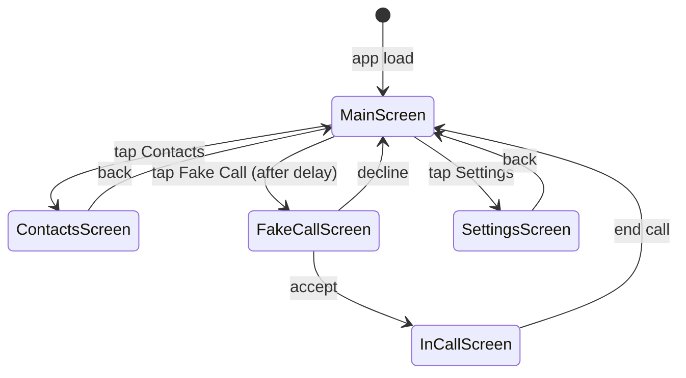

# Design Document: SafeHer

## Overview

SafeHer is a single-file web prototype of a mobile safety application targeting women in emergency situations. The entire application is delivered as one self-contained HTML file using vanilla HTML5, CSS3, and ES6+ JavaScript with no build step or backend. All state is persisted to `localStorage`. Device APIs (Geolocation, DeviceMotionEvent, Web Notifications) are accessed directly from the browser.

The UI is organized as a multi-screen single-page application (SPA) driven by a lightweight client-side router that swaps visible `<section>` panels. The main screen presents four large feature buttons; secondary screens handle contacts management and fake-call configuration.

### Design Goals

- Zero-dependency runtime (no npm, no bundler, no server)
- Operable under stress: large touch targets, high-contrast colors, minimal cognitive load
- Graceful degradation when device APIs are unavailable or denied
- All sensitive data stays on-device (localStorage only)

---

## Architecture

The application follows a simple layered architecture within a single file:

```
┌─────────────────────────────────────────────────────┐
│                    HTML Structure                    │
│  #screen-main  #screen-contacts  #screen-fake-call  │
│  #screen-in-call  #screen-settings                  │
└──────────────────────┬──────────────────────────────┘
                       │ DOM events
┌──────────────────────▼──────────────────────────────┐
│                  UI Controller Layer                 │
│  router · screenManager · toastManager              │
└──────────────────────┬──────────────────────────────┘
                       │ calls
┌──────────────────────▼──────────────────────────────┐
│                  Feature Modules                     │
│  EmergencyAlert · LocationSharing · FakeCall        │
│  ShakeDetector  · ContactsManager                   │
└──────────────────────┬──────────────────────────────┘
                       │ reads/writes
┌──────────────────────▼──────────────────────────────┐
│                  Service Layer                       │
│  GeoService · NotificationService · StorageService  │
└─────────────────────────────────────────────────────┘
```

### Screen Flow



---

## Components and Interfaces

### Router / Screen Manager

Manages which `<section>` is visible. Each screen has a unique `id`.

```js
// showScreen(id: string) → void
// Hides all sections, shows the one matching id, updates history state
showScreen('screen-contacts')
```

### EmergencyAlert Module

Orchestrates the full alert flow: acquire location → compose message → dispatch to all contacts → show confirmation.

```js
// triggerAlert() → Promise<AlertResult>
// AlertResult: { sent: Contact[], failed: Contact[], location: Coords | null }
```

- Calls `GeoService.getCurrentPosition()` with a 5-second timeout
- Falls back to `GeoService.getLastKnown()` if timeout exceeded
- Iterates contacts, calls `NotificationService.send(contact, message)` concurrently via `Promise.allSettled`
- Retries failed deliveries up to 3 times at 30-second intervals

### LocationSharing Module

```js
// startSharing(durationMs: number) → void
// stopSharing() → void
// isActive() → boolean
```

- Uses `navigator.geolocation.watchPosition` for continuous updates
- Broadcasts to contacts every ≤30 seconds via `NotificationService`
- Stores a `setInterval` handle and a `setTimeout` for auto-stop
- Updates the UI indicator via a CSS class toggle on `#btn-share`

### FakeCall Module

```js
// scheduleFakeCall(delayMs: number) → void
// acceptCall() → void
// declineCall() → void
// endCall() → void
```

- Uses `setTimeout` for the configurable delay (0–60 s)
- Plays ringtone via the Web Audio API (generated tone) or an `<audio>` element
- Manages the call timer with `setInterval`

### ShakeDetector Module

```js
// enable() → void
// disable() → void
// isEnabled() → boolean
// onShake(callback: () => void) → void  // internal event hook
```

- Listens to `DeviceMotionEvent`
- Computes resultant acceleration: `√(x²+y²+z²)`
- Triggers when acceleration > 2.5g sustained for ≥500 ms
- Calls `EmergencyAlert.triggerAlert()` on shake detection
- Persists enabled state to `StorageService`

### ContactsManager Module

```js
// getContacts() → Contact[]
// addContact(data: ContactInput) → Contact
// updateContact(id: string, data: Partial<ContactInput>) → Contact
// removeContact(id: string) → void
// setPrimary(id: string) → void
// initiateVerification(id: string) → void
```

- All mutations immediately call `StorageService.save('contacts', contacts)`
- Enforces 1–10 contact limit
- Enforces single primary contact invariant

### GeoService

```js
// getCurrentPosition(timeoutMs?: number) → Promise<GeolocationCoordinates>
// getLastKnown() → GeolocationCoordinates | null
// watchPosition(callback) → watchId
// clearWatch(watchId) → void
```

Wraps `navigator.geolocation` with Promise-based API and caches the last known position.

### NotificationService

```js
// send(contact: Contact, message: Message) → Promise<DeliveryResult>
// requestPermission() → Promise<NotificationPermission>
```

In this prototype, "sending" is simulated:
- **SMS**: displays a toast/modal showing the SMS content that would be sent
- **Push**: fires a `new Notification(...)` via the Web Notifications API

### StorageService

```js
// save(key: string, value: unknown) → void
// load<T>(key: string, fallback: T) → T
// remove(key: string) → void
```

Thin wrapper around `localStorage` with JSON serialization.

---

## Data Models

### Contact

```ts
interface Contact {
  id: string;                          // UUID v4
  name: string;
  phone: string;                       // validated format
  role: 'Family' | 'Friend' | 'Colleague' | 'Other';
  isPrimary: boolean;
  notificationPrefs: ('sms' | 'push')[]; // defaults to both
  verification: {
    status: 'unverified' | 'pending' | 'verified' | 'expired';
    code?: string;                     // one-time code sent
    sentAt?: number;                   // epoch ms
  };
}
```

### AppSettings

```ts
interface AppSettings {
  shakeEnabled: boolean;
  fakeCallName: string;                // defaults to "Mom"
  fakeCallDelay: number;               // seconds, 0–60
  locationSharingDuration: number;     // minutes, 15–480
}
```

### AlertResult

```ts
interface AlertResult {
  timestamp: number;
  location: { lat: number; lng: number; accuracy: number } | null;
  locationStale: boolean;
  deliveries: {
    contactId: string;
    status: 'sent' | 'failed';
    attempts: number;
  }[];
}
```

### Message

```ts
interface Message {
  type: 'emergency' | 'location-update' | 'verification';
  body: string;
  location?: { lat: number; lng: number };
}
```

### localStorage Keys

| Key | Type | Description |
|-----|------|-------------|
| `safeher_contacts` | `Contact[]` | Persisted contact list |
| `safeher_settings` | `AppSettings` | App-wide settings |
| `safeher_last_location` | `{lat,lng,accuracy,ts}` | Last known GPS fix |
| `safeher_alert_log` | `AlertResult[]` | History of sent alerts |


---

## Correctness Properties

*A property is a characteristic or behavior that should hold true across all valid executions of a system — essentially, a formal statement about what the system should do. Properties serve as the bridge between human-readable specifications and machine-verifiable correctness guarantees.*

### Property 1: Alert reaches every contact

*For any* non-empty list of trusted contacts, when `triggerAlert()` is called, the resulting `AlertResult.deliveries` array must contain exactly one entry per contact (no contact is skipped, no contact appears twice), and all deliveries must be attempted concurrently (via `Promise.allSettled`).

**Validates: Requirements 1.3, 5.26**

---

### Property 2: Stale-location fallback sets the staleness flag

*For any* alert triggered when `GeoService.getCurrentPosition()` rejects or times out, the resulting `AlertResult` must have `locationStale = true` and `location` must equal the last cached coordinates (or `null` if no cache exists). The alert must still be dispatched — it must not be suppressed.

**Validates: Requirements 1.4**

---

### Property 3: Location sharing interval invariant

*For any* active sharing session, the time between consecutive location updates dispatched to contacts must be greater than 0 and no greater than 30,000 milliseconds.

**Validates: Requirements 2.2**

---

### Property 4: Sharing active indicator mirrors sharing state

*For any* call to `startSharing()`, the main-screen share button must carry the `active` CSS class (or equivalent aria attribute). *For any* call to `stopSharing()`, that class must be absent. The UI state must always reflect the module state.

**Validates: Requirements 2.3, 2.4**

---

### Property 5: Sharing duration validation

*For any* duration value supplied by the user, values outside the range [15, 480] minutes must be rejected (clamped or shown an error) and must never be passed to `startSharing()`.

**Validates: Requirements 2.6**

---

### Property 6: Fake call delay validation

*For any* delay value supplied by the user, values outside the range [0, 60] seconds must be rejected and must never be passed to `scheduleFakeCall()`.

**Validates: Requirements 3.7**

---

### Property 7: Shake threshold triggers alert

*For any* synthetic `DeviceMotionEvent` sequence where the resultant acceleration `√(x²+y²+z²)` exceeds 24.5 m/s² (≈2.5g) continuously for at least 500 milliseconds, the `ShakeDetector` must invoke its registered `onShake` callback exactly once per shake event.

**Validates: Requirements 4.2**

---

### Property 8: Shake detector toggle round-trip

*For any* initial state of the `ShakeDetector`, calling `enable()` followed by `disable()` must result in `isEnabled() === false` and the `DeviceMotionEvent` listener must be removed. Calling `disable()` followed by `enable()` must result in `isEnabled() === true` and the listener must be registered.

**Validates: Requirements 4.4, 4.5**

---

### Property 9: Contact list persistence round-trip

*For any* sequence of `addContact`, `updateContact`, or `removeContact` operations, calling `StorageService.load('safeher_contacts')` immediately after must return a list that exactly reflects all applied mutations — no operation is lost, no phantom entry appears.

**Validates: Requirements 5.5, 5.9**

---

### Property 10: Contact capacity constraint

*For any* contact list already containing 10 contacts, calling `addContact()` must throw or return an error and must leave the stored list unchanged at 10 entries.

**Validates: Requirements 5.4**

---

### Property 11: Phone number format validation

*For any* string input to the phone number field, the validator must accept strings that match the pattern `^\+?[\d\s\-\(\)]+$` and reject all others. Accepted strings must be stored; rejected strings must produce an inline error and must not be stored.

**Validates: Requirements 5.8**

---

### Property 12: Role default and constraint

*For any* contact created without an explicit role, the stored `role` field must equal `"Other"`. *For any* role assignment, only the values `"Family"`, `"Friend"`, `"Colleague"`, and `"Other"` must be accepted; any other value must be rejected.

**Validates: Requirements 5.10, 5.12**

---

### Property 13: Exactly one primary contact invariant

*For any* sequence of `setPrimary(id)` calls on a contact list with ≥1 contacts, after each call exactly one contact in the list must have `isPrimary === true`, and it must be the contact with the given `id`.

**Validates: Requirements 5.13, 5.14**

---

### Property 14: Contact card renders all required fields

*For any* contact object, the rendered HTML card must contain: the contact's name, phone number, role label, primary indicator (if `isPrimary`), and verification status badge. No field may be silently omitted.

**Validates: Requirements 5.11, 5.15, 5.25**

---

### Property 15: Delivery respects notification preferences

*For any* contact with a configured `notificationPrefs` array, when an alert or location update is dispatched to that contact, `NotificationService.send` must be called only with the delivery methods present in that contact's `notificationPrefs`. Methods not in the array must never be invoked for that contact.

**Validates: Requirements 5.18, 5.19**

---

### Property 16: Default notification preference

*For any* contact whose `notificationPrefs` is empty or undefined, the effective preferences used during dispatch must equal `['sms', 'push']`.

**Validates: Requirements 5.20**

---

### Property 17: Verification state machine

*For any* contact, calling `initiateVerification(id)` must set `verification.status = 'pending'` and store a `code` and `sentAt` timestamp. Supplying the correct code within 24 hours must transition status to `'verified'`. Supplying an incorrect code must leave status as `'pending'`. After 24 hours without a correct reply, status must transition to `'expired'`.

**Validates: Requirements 5.21, 5.23, 5.24**

---

### Property 18: Retry count invariant

*For any* contact whose initial delivery attempt fails, the system must retry at most 3 additional times (4 total attempts). After 4 failed attempts the delivery status must be `'failed'` and no further retries must occur.

**Validates: Requirements 5.27**

---

### Property 19: Location sharing message contains viewer link

*For any* initial location-sharing alert message dispatched to a contact, the message body must contain a non-empty string that serves as a link or mechanism for the contact to view live location updates.

**Validates: Requirements 5.29**

---

### Property 20: Location permission denial disables dependent features

*For any* app state where location permission is `'denied'`, the Emergency Alert button, Share Location button, and Shake-to-Alert toggle must all be in a visually disabled state and must not invoke `GeoService` when interacted with.

**Validates: Requirements 6.3**

---

### Property 21: Primary button touch targets

*For any* primary feature button rendered on the main screen, its computed width and height (via `getBoundingClientRect`) must each be ≥ 64 pixels.

**Validates: Requirements 7.2**

---

### Property 22: Primary buttons have distinct colors

*For any* pair of distinct primary feature buttons on the main screen, their computed `background-color` CSS values must differ.

**Validates: Requirements 7.3**

---

### Property 23: Primary buttons contain icon and label

*For any* primary feature button, the button element must contain at least one child element serving as an icon (emoji or ``) and at least one child element containing a non-empty text label.

**Validates: Requirements 7.4**

---

## Error Handling

### Geolocation Errors

| Scenario | Handling |
|----------|----------|
| Permission denied | Disable location-dependent features; show persistent banner |
| Timeout (>5s) | Fall back to last known location; set `locationStale=true` |
| Position unavailable | Same as timeout fallback |
| No cached location | Send alert with `location: null`; message body notes location unavailable |

### Contact Delivery Errors

- `Promise.allSettled` ensures one contact's failure never blocks others
- Failed deliveries are retried up to 3 times with 30-second delays via recursive `setTimeout`
- After 3 retries, delivery is marked `failed` and surfaced in the confirmation UI
- The user sees a per-contact status list (✓ sent / ✗ failed) on the alert confirmation screen

### DeviceMotionEvent Errors

- If `DeviceMotionEvent` is not supported, the Shake-to-Alert toggle is hidden and a tooltip explains the limitation
- If permission is required (iOS 13+) and denied, the toggle is disabled with an explanatory message

### localStorage Errors

- All `StorageService` writes are wrapped in try/catch
- On `QuotaExceededError`, the user is shown a toast warning that data could not be saved
- Reads always provide a typed fallback value so the app never crashes on missing keys

### Audio Errors

- If the Web Audio API or `<audio>` element fails to play the ringtone, the fake call screen still appears silently — the visual UI is not blocked by audio failure

---

## Testing Strategy

### Dual Testing Approach

Both unit tests and property-based tests are required. They are complementary:

- **Unit tests** verify specific examples, integration points, and edge cases
- **Property tests** verify universal invariants across randomized inputs

### Property-Based Testing Library

For a vanilla JS single-file app, use **[fast-check](https://fast-check.dev/)** loaded from CDN in the test harness:

```html
<script src="https://cdn.jsdelivr.net/npm/fast-check/lib/bundle/fast-check.min.js"></script>
```

Each property test must run a minimum of **100 iterations**.

Each test must be tagged with a comment in this format:

```js
// Feature: safe-her, Property N: <property_text>
```

### Unit Test Coverage

Focus unit tests on:

- **Main screen renders**: all 4 buttons present, correct icons and labels (Req 7.1, 7.4)
- **Empty contacts guard**: `triggerAlert()` with zero contacts returns error state (Req 1.5)
- **Fake call default caller**: no config → caller name is "Mom" (Req 3.3)
- **Accept/decline transitions**: correct screen shown after each action (Req 3.5, 3.6)
- **Shake detector registration**: `enable()` registers `devicemotion` listener (Req 4.1)
- **First-launch permission requests**: location and contacts permissions requested on first open (Req 6.1, 6.2)
- **Contacts screen renders**: contact list visible on contacts screen (Req 5.6)
- **Verification SMS dispatched**: `initiateVerification()` calls `NotificationService.send` with type `'verification'` (Req 5.22)

### Property Test Specifications

Each of the 23 correctness properties above maps to exactly one property-based test:

```js
// Feature: safe-her, Property 1: Alert reaches every contact
fc.assert(fc.asyncProperty(fc.array(arbContact, {minLength: 1, maxLength: 10}), async (contacts) => {
  StorageService.save('safeher_contacts', contacts);
  const result = await EmergencyAlert.triggerAlert();
  return result.deliveries.length === contacts.length
    && contacts.every(c => result.deliveries.some(d => d.contactId === c.id));
}), { numRuns: 100 });
```

```js
// Feature: safe-her, Property 11: Phone number format validation
fc.assert(fc.property(fc.string(), (input) => {
  const valid = /^\+?[\d\s\-\(\)]+$/.test(input.trim()) && input.trim().length > 0;
  const result = ContactsManager.validatePhone(input);
  return result.valid === valid;
}), { numRuns: 100 });
```

```js
// Feature: safe-her, Property 13: Exactly one primary contact invariant
fc.assert(fc.property(
  fc.array(arbContact, {minLength: 1, maxLength: 10}),
  fc.integer({min: 0, max: 9}),
  (contacts, idx) => {
    const target = contacts[Math.min(idx, contacts.length - 1)];
    ContactsManager.setPrimary(target.id);
    const stored = ContactsManager.getContacts();
    return stored.filter(c => c.isPrimary).length === 1
      && stored.find(c => c.isPrimary).id === target.id;
  }
), { numRuns: 100 });
```

### Edge Case Tests

The following edge cases must have dedicated unit tests:

| Edge Case | Requirement |
|-----------|-------------|
| Alert with stale/null location | 1.4 |
| Location service unavailable during sharing | 2.5 |
| Contacts permission denied → manual entry shown | 5.2 |
| Remove last contact that is also primary → warning shown | 5.16 |
| Battery below 10% → shake detector warning | 4.6 |
| Verification code expired after 24h | 5.24 |
| localStorage quota exceeded | Error Handling |
